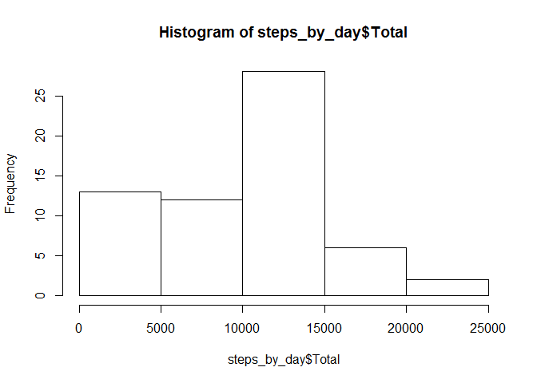
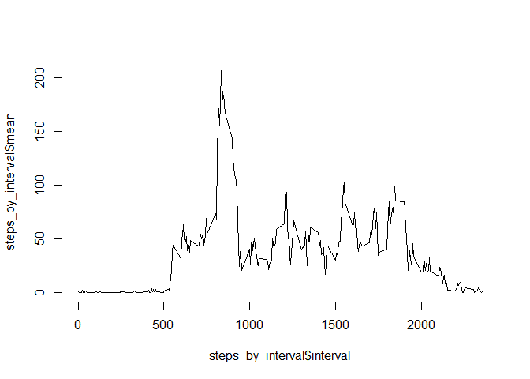
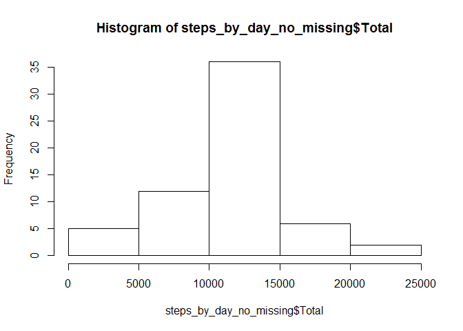
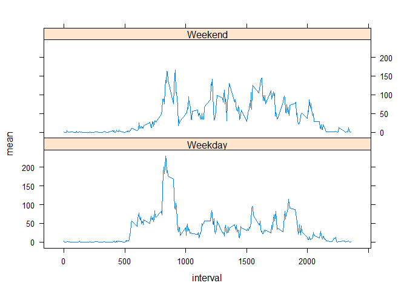

# Reproducible Research: Peer Assessment 1


## Loading and preprocessing the data
1. Load the data (i.e. `read.csv()`)

```r
setwd("~/Data Science/Reproducible Research/Project 1/RepData_PeerAssessment1")
steps_dt <- read.csv(unz("activity.zip", "activity.csv"))
head(steps_dt,5)
```

```
##   steps       date interval
## 1    NA 2012-10-01        0
## 2    NA 2012-10-01        5
## 3    NA 2012-10-01       10
## 4    NA 2012-10-01       15
## 5    NA 2012-10-01       20
```


## What is mean total number of steps taken per day?
1. Make a histogram of the total number of steps taken each day.

```r
suppressWarnings(suppressMessages(library(dplyr)))
steps_by_day <- group_by(steps_dt,date) %>% summarise(Total = sum(steps, na.rm = TRUE))
hist(steps_by_day$Total)
```

\
2. Calculate and report the **mean** and **median** total number of steps taken per day.

```r
mean(steps_by_day$Total)
```

```
## [1] 9354.23
```

```r
median(steps_by_day$Total)
```

```
## [1] 10395
```


## What is the average daily activity pattern?
1. Make a time series plot (i.e. `type = "l"`) of the 5-minute interval (x-axis) and the average number of steps taken, averaged across all days (y-axis).

```r
steps_by_interval <- group_by(steps_dt,interval) %>% summarise(mean = mean(steps, na.rm = TRUE))
plot(steps_by_interval$interval, steps_by_interval$mean, type = "l")
```

\
2. Which 5-minute interval, on average across all the days in the dataset, contains the maximum number of steps?

```r
steps_by_interval$interval[which.max(steps_by_interval$mean)]
```

```
## [1] 835
```


## Imputing missing values
1. Calculate and report the total number of missing values in the dataset (i.e. the total number of rows with `NA`s).

```r
sum(is.na(steps_dt$steps))
```

```
## [1] 2304
```
2. Devise a strategy for filling in all of the missing values in the dataset. The strategy does not need to be sophisticated. For example, you could use the mean/median for that day, or the mean for that 5-minute interval, etc.

Missing data will be replaced by the mean data for the 5-minute interval averaged over all days rounded to the nearest step.

3. Create a new dataset that is equal to the original dataset but with the missing data filled in.

```r
steps_no_missing <- steps_dt
for (i in 1:length(steps_dt$steps)){
     if(is.na(steps_no_missing$steps[i])){
          steps_no_missing$steps[i] <-
               round(steps_by_interval$mean[
                    match(steps_no_missing$interval[i],steps_by_interval$interval)]
               )
     }
}
head(steps_no_missing,5)
```

```
##   steps       date interval
## 1     2 2012-10-01        0
## 2     0 2012-10-01        5
## 3     0 2012-10-01       10
## 4     0 2012-10-01       15
## 5     0 2012-10-01       20
```
4. Make a histogram of the total number of steps taken each day and Calculate and report the **mean** and **median** total number of steps taken per day. Do these values differ from the estimates from the first part of the assignment? What is the impact of imputing missing data on the estimates of the total daily number of steps?

```r
steps_by_day_no_missing <- group_by(steps_no_missing,date) %>% summarise(Total = sum(steps, na.rm = TRUE))
hist(steps_by_day_no_missing$Total)
```

\

```r
mean(steps_by_day_no_missing$Total)
```

```
## [1] 10765.64
```

```r
median(steps_by_day_no_missing$Total)
```

```
## [1] 10762
```
The new mean and median are greater than the originally calculated estimates.  The impact of imputing the missing data is to increase the number of steps each day and bring the mean and median values much closer.


## Are there differences in activity patterns between weekdays and weekends?
1. Create a new factor variable in the dataset with two levels -- "weekday" and "weekend" indicating whether a given date is a weekday or weekend day.

```r
suppressWarnings(suppressMessages(library(chron)))
steps_weekday <- steps_no_missing
steps_weekday$day <- lapply(is.weekend(steps_weekday$date), function(x) if(x) {"Weekend"} else {"Weekday"})
steps_weekday$day <- unlist(steps_weekday$day)
head(steps_weekday,5)
```

```
##   steps       date interval     day
## 1     2 2012-10-01        0 Weekday
## 2     0 2012-10-01        5 Weekday
## 3     0 2012-10-01       10 Weekday
## 4     0 2012-10-01       15 Weekday
## 5     0 2012-10-01       20 Weekday
```

```r
steps_weekday_by_interval <- group_by(steps_weekday,interval,day) %>% summarise(mean = mean(steps, na.rm = TRUE))
head(steps_weekday_by_interval,5)
```

```
## Source: local data frame [5 x 3]
## Groups: interval [3]
## 
##   interval     day      mean
##      (int)   (chr)     (dbl)
## 1        0 Weekday 2.2888889
## 2        0 Weekend 0.2500000
## 3        5 Weekday 0.4000000
## 4        5 Weekend 0.0000000
## 5       10 Weekday 0.1555556
```
2. Make a panel plot containing a time series plot (i.e. `type = "l"`) of the 5-minute interval (x-axis) and the average number of steps taken, averaged across all weekday days or weekend days (y-axis).

```r
suppressWarnings(suppressMessages(library(lattice)))
xyplot(mean ~ interval|day, data = steps_weekday_by_interval, layout = c(1,2), type='l')
```

\

